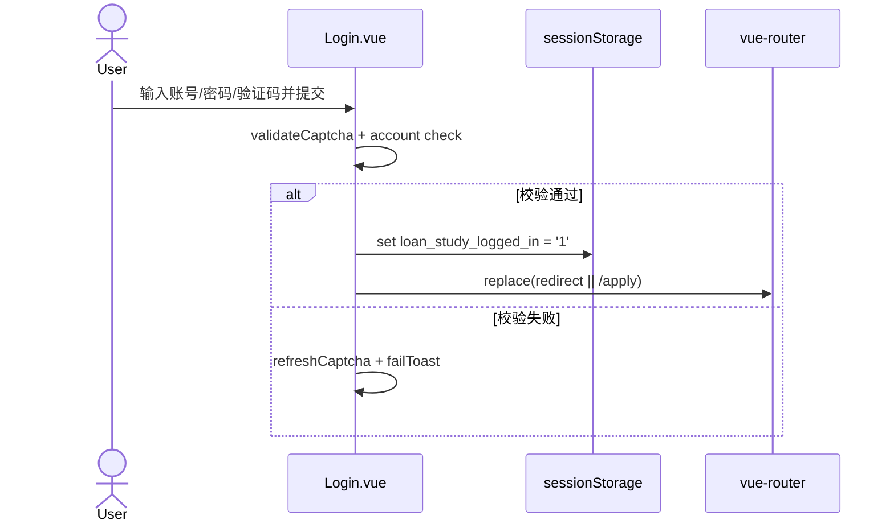
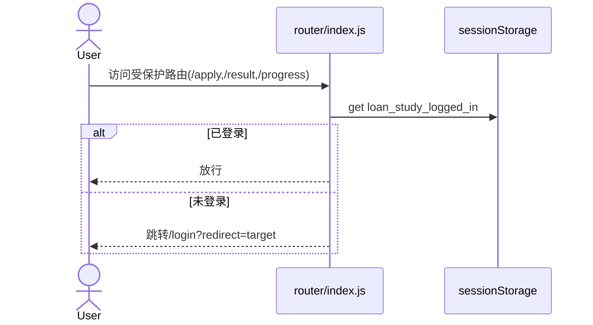
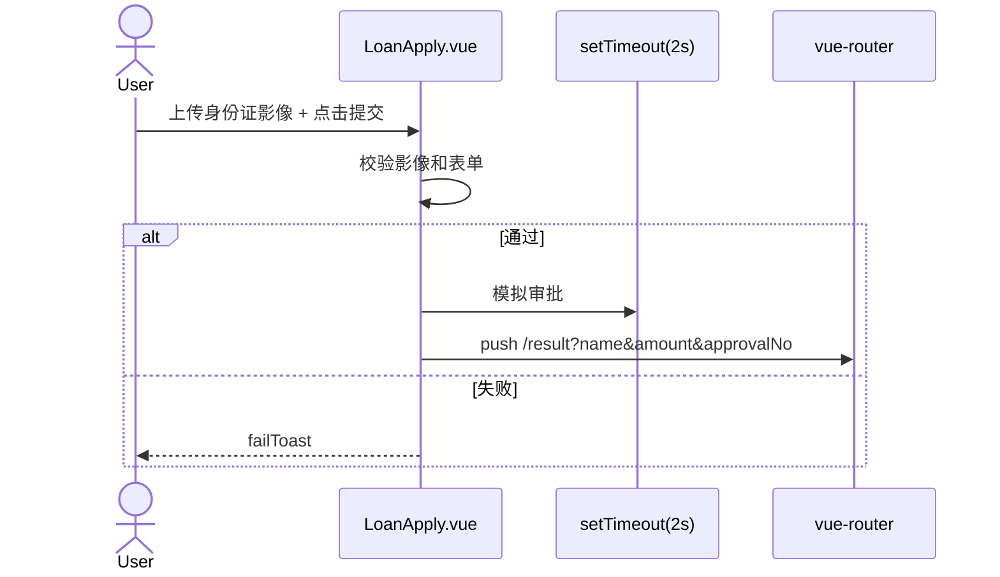
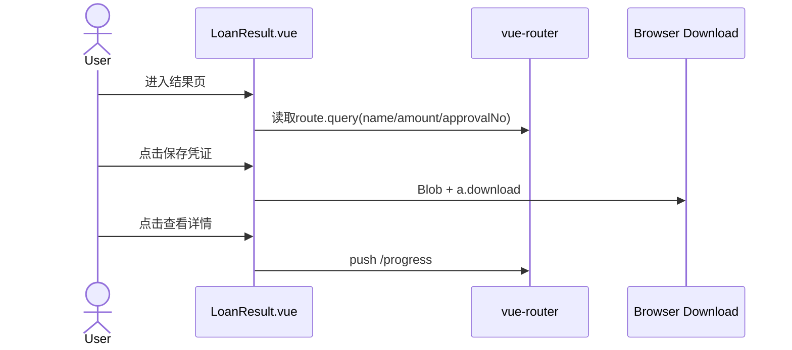
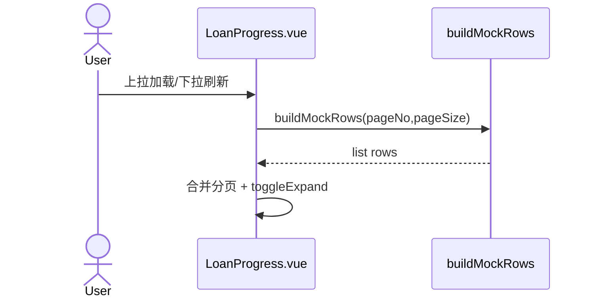

# Loan Study Flow And API Refactor

## As-Is Sequence Diagrams

### 1) Login (`Login.vue::handleLogin`)

### 2) Route Guard (`router.beforeEach`)

### 3) Apply Submit (`LoanApply.vue::submitApply`)

### 4) Result Display (`LoanResult.vue`)

### 5) Progress List (`LoanProgress.vue::onLoad`)

## To-Be Implementation (Implemented In This Repo)

### API Layers
- `src/api/http.js`: request wrapper, timeout, ApiError, 401 centralized handling.
- `src/api/auth.js`: captcha + password login.
- `src/api/upload.js`: ID card image upload.
- `src/api/loan.js`: create application, detail, paginated list.
- `src/api/progress.js`: progress page query facade.
- `src/api/mockServer.js`: local mock API adapter for dev fallback when `VITE_API_BASE_URL` is not configured.

### Session And Guard
- `src/session/authSession.js`: `saveSession/getSession/clearSession/isSessionValid`.
- `src/router/index.js`: token-based route guard, protected route `/result/:applicationId`, unauthorized redirect with `redirect` recovery.

### Page Data Flow
- `Login.vue`
  - captcha from `GET /api/auth/captcha`.
  - login from `POST /api/auth/login`.
  - save token session and redirect.
- `LoanApply.vue`
  - upload images first (`POST /api/uploads/id-cards`).
  - create application (`POST /api/loan/applications`) with idempotency key.
  - navigate to `/result/:applicationId`.
- `LoanResult.vue`
  - fetch detail by `applicationId` (`GET /api/loan/applications/{id}`).
  - supports refresh-safe detail recovery and retry path.
- `LoanProgress.vue`
  - fetch paged list from API (`GET /api/loan/applications?pageNo&pageSize`).
  - keeps pull-refresh and infinite-scroll behavior.

### Error Handling
- 401: clear session + route to `/login` with redirect.
- timeout: unified `ApiError(408)` message.
- page-level errors: empty/failure states with retry actions.

### Acceptance Checklist
- no query-based transfer for result core data.
- no view-layer mock builder for progress list.
- all protected pages guarded by token session.

## Optional Backend Switch
- Set `VITE_API_BASE_URL` to real backend base URL to disable local mock adapter.
- Keep `VITE_USE_MOCK_API=false` to force real network mode.
